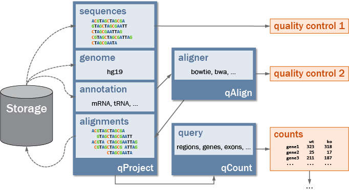

<!--
\DeclareRobustCommand{\QuasRlogo}{\raisebox{-8mm}{\includegraphics[width=45mm]{QuasR-logo.pdf}}}% use \DeclareRobustCommand instead of \newcommand to avoid premature expansion of \QuasRlogo within by 'titling' package
-->


<!--
```{r options, results='hide', echo=FALSE}
#options(width=65)
options('useFancyQuotes' = FALSE, continue=" ", digits=3)
```
-->


# Introduction

The `r Biocpkg("QuasR")` package (short for _Qu_antify and _a_nnotate _s_hort reads
in _R_) integrates the functionality of several **R** packages (such as `r Biocpkg("IRanges")` [@IRanges]
and `r Biocpkg("Rsamtools")`) and external software (e.g. `bowtie`, through the `r Biocpkg("Rbowtie")` package).
The package aims to cover the whole analysis workflow of typical ultra-high throughput
sequencing experiments, starting from the raw sequence reads, over pre-processing and
alignment, up to quantification. A single **R** script can contain all steps of a complete
analysis, making it simple to document, reproduce or share the workflow containing all
relevant details.

The current `r Biocpkg("QuasR")` release supports the analysis of single read and
paired-end ChIP-seq (chromatin immuno-precipitation combined with sequencing), RNA-seq
(gene expression profiling by sequencing of RNA) and Bis-seq (measurement of DNA
methylation by sequencing of bisulfite-converted genomic DNA) experiments. It has
been successfully used with data from Illumina GA/GA II/MiSeq/HiSeq, 454 Life
Technologies and SOLiD sequencers, the latter by using bam files created externally
of `r Biocpkg("QuasR")`.

# Preliminaries

## Citing `r Biocpkg("QuasR")`
If you use `r Biocpkg("QuasR")` [@QuasR] in your work, you can cite it as follows:
```{r cite, eval=TRUE}
citation("QuasR")
```

## Installation{#installation}
`r Biocpkg("QuasR")` is a package for the **R** computing environment and it is
assumed that you have already installed **R**. See the **R** project at (http://www.r-project.org).
To install the latest version of `r Biocpkg("QuasR")`, you will need to be using the
latest version of **R**. `r Biocpkg("QuasR")` is part of the Bioconductor project
at (http://www.bioconductor.org). To get `r Biocpkg("QuasR")` together with its
dependencies you can use
```{r install, eval=FALSE}
if (!require("BiocManager"))
    install.packages("BiocManager")
BiocManager::install("QuasR")
```

Bioconductor works on a 6-monthly official release cycle. As with other Bioconductor
packages, there are always two versions of `r Biocpkg("QuasR")`. Most users will
use the current official release version, which will be installed by `BiocManager::install`
if you are using the current release version of **R**. There is also a development version
of `r Biocpkg("QuasR")` that includes new features due for the next official release.
The development version will be installed if you are using the development version of
**Bioconductor** (see `version = "devel"` in `r Biocpkg("BiocManager")`). The official
release version always has an even second number (for example 1.20.1), whereas the
developmental version has an odd second number (for example 1.21.4).

## Loading of *QuasR* and other required libraries
In order to run the code examples in this vignette, the `r Biocpkg("QuasR")` library
and a few additional libraries need to be loaded:
```{r loadLibraries, eval=TRUE}
library(QuasR)
library(BSgenome)
library(Rsamtools)
library(rtracklayer)
library(GenomicFeatures)
library(Gviz)
```

## How to get help
Most questions about `r Biocpkg("QuasR")` will hopefully be answered by the documentation
or references. If you've run into a question which isn't addressed by the documentation,
or you've found a conflict between the documentation and software itself, then there
is an active support community which can offer help.

The authors of the package (maintainer: `r maintainer("QuasR")`) always appreciate
receiving reports of bugs in the package functions or in the documentation. The same
goes for well-considered suggestions for improvements. 

Any other questions or problems concerning `r Biocpkg("QuasR")` should be posted
to the Bioconductor support site (https://support.bioconductor.org). Users posting
to the support site for the first time should read the helpful posting guide at
(https://support.bioconductor.org/info/faq/). Note that each function in `r Biocpkg("QuasR")`
has it's own help page, as described in the section \@ref(introToR).
Posting etiquette requires that you read the relevant help page carefully before
posting a problem to the site.


# Quick Start
## A brief introduction to **R**{#introToR}
If you already use **R** and know about its command line interface, just skip this
section and continue with section \@ref(sampleQuasRsession).

The structure of this vignette and in particular this section is based on the excellent
user guide of the `r Biocpkg("limma")` package, which we would like to hereby acknowledge.
**R** is a program for statistical computing. It is a command-driven language meaning
that you have to type commands into it rather than pointing and clicking using a mouse.
In this guide it will be assumed that you have successfully downloaded and installed **R**
from (http://www.r-project.org) as well as `r Biocpkg("QuasR")` (see section \@ref(installation)).
A good way to get started is to type
```{r help1, eval=FALSE}
help.start()
```

at the **R** prompt or, if you're using **R** for Windows, to follow the drop-down
menu items *Help* $\succ$ *Html help*. Following the links *Packages* $\succ$ `r Biocpkg("QuasR")`
from the html help page will lead you to the contents page of help topics for functions
in `r Biocpkg("QuasR")`.  

Before you can use any `r Biocpkg("QuasR")` commands you have to load the package
by typing
```{r loadQuasRLibrary, eval=FALSE}
library(QuasR)
```

at the **R** prompt. You can get help on any function in any loaded package by typing
`?` and the function name at the **R** prompt, for example
```{r help2, eval=FALSE}
?preprocessReads
```

or equivalently
```{r help3, eval=FALSE}
help("preprocessReads")
```

for detailed help on the `preprocessReads` function. The individual function help
pages are especially important for listing all the arguments which a function will
accept and what values the arguments can take.

A key to understanding **R** is to appreciate that anything that you create in **R**
is an *object*. Objects might include data sets, variables, functions, anything at all.
For example
```{r assign, eval=FALSE}
x <- 2
```

will create a variable `x` and will assign it the value 2. At any stage of your **R**
session you can type
```{r ls, eval=FALSE}
ls()
```

to get a list of all the objects you have created. You can see the contents of any
object by typing the name of the object at the prompt. The following command will
print out the contents of `x`:
```{r printObject, eval=FALSE}
x
```

We hope that you can use `r Biocpkg("QuasR")` without having to spend a lot of time
learning about the **R** language itself but a little knowledge in this direction
will be very helpful, especially when you want to do something not explicitly provided
for in `r Biocpkg("QuasR")` or in the other Bioconductor packages. For more details
about the **R** language see *An Introduction to R* which is available from the online
help. For more background on using **R** for statistical analysis see [@Dalgaard].


## Sample *QuasR* session{#sampleQuasRsession}
This is a quick overview of what an analysis could look like for users preferring
to jump right into an analysis. The example uses data that is provided with the
`r Biocpkg("QuasR")` package, which is first copied to the current working directory,
into a subfolder called `"extdata"`:
```{r SampleSession1, eval=TRUE}
file.copy(system.file(package="QuasR", "extdata"), ".", recursive=TRUE)
```

The sequence files to be analyzed are listed in `sampleFile` (see section \@ref(sampleFile) for details).
The sequence reads will be aligned using `bowtie` [@bowtie] (from the `r Biocpkg("Rbowtie")`
package [@Rbowtie]) to a small reference genome (consisting of three short segments
from the hg19 human genome assembly, available in full for example in the
`r Biocpkg("BSgenome.Hsapiens.UCSC.hg19")` package). Make sure that you have sufficient
disk space, both in your **R** temporary directory (`tempdir()`) as well as to
store the resulting alignments (see section \@ref(qAlign)).
```{r SampleSession2, eval=TRUE}
sampleFile <- "extdata/samples_chip_single.txt"
genomeFile <- "extdata/hg19sub.fa"

proj <- qAlign(sampleFile, genomeFile)
proj
```

The `proj` object keeps track of all the information of a sequencing experiment,
for example where sequence and alignment files are stored, and what aligner and
reference genome was used to generate the alignments.

Now that the alignments have been generated, further analyses can be performed.
A quality control report is saved to the `"extdata/qc\_report.pdf"` file using the
`qQCReport` function.
```{r SampleSession3, eval=TRUE}
qQCReport(proj, "extdata/qc_report.pdf")
```

The number of alignments per promoter region is quantified using `qCount`. Genomic
coordinates for promoter regions are imported from a gtf file (`annotFile`) into
the `GRanges`-object with the name `promReg`:
```{r SampleSession4, eval=TRUE}
library(rtracklayer)
library(GenomicFeatures)
annotFile <- "extdata/hg19sub_annotation.gtf"
txStart <- import.gff(annotFile, format="gtf", feature.type="start_codon")
promReg <- promoters(txStart, upstream=500, downstream=500)
names(promReg) <- mcols(promReg)$transcript_name

promCounts <- qCount(proj, query=promReg)
promCounts
```
 
# *QuasR* Overview
The following scheme shows the major components of `r Biocpkg("QuasR")` and their
relationships:


`r Biocpkg("QuasR")` works with data (sequences and alignments, reference genome,
etc.) that are stored as files on your storage (the gray cylinder on the lower left
of Figure above, see section \@ref(fileStorageLocations) for details on storage locations).
`r Biocpkg("QuasR")` does not need a database management system, or these files to
be named and organized according to a specific scheme.

In order to keep track of directory paths during an analysis, `r Biocpkg("QuasR")`
makes use of a `qProject` object that is returned by the `qAlign` function, which
at the minimum requires two inputs: the name of a samples text file (see section
\@ref(sampleFile) for details), and the reference genome for the alignments
(see section \@ref(genome)).

The `qProject` object is the main argument passed to subsequent functions such as
`qQCReport` and `qCount`. The `qProject` object contains all necessary information
on the current project and eliminates the need to repeatedly enter the same information.
All functions that work on `qProject` objects can be recognized by their names starting
with the letter *q*.

Read quantification (apart from quantification of methylation which has its own
function `qMeth`) is done using the `qCount` function: It counts the alignments in
regions of interest (e.g. promoters, genes, exons, etc.) and produces a count table
(regions in rows, samples in columns) for further visualization and analysis. The
count table can also be used as input to a statistical analysis using packages such
as `r Biocpkg("edgeR")` [@edgeR], `r Biocpkg("DESeq")` [@DESeq], `r Biocpkg("DESeq2")`,
`r Biocpkg("TCC")` [@TCC], `r Biocpkg("DEXSeq")` [@DEXSeq] or `r Biocpkg("baySeq")` [@baySeq].

In summary, a typical `r Biocpkg("QuasR")` analysis consists of the following steps
(some of them are optional):

- `preprocessReads` (optional): Remove adapters from start or end of reads, filter
  out reads of low quality, short length or low complexity (section \@ref(preProcessing)).  
- Prepare *samples file*: List sequence files or alignments, provide sample names
  (section \@ref(sampleFile)).  
- Prepare *auxiliary file* (optional): List additional reference sequences for
  alignment of reads not matching the reference genome (section \@ref(auxiliaryFile)).  
- `qAlign`: Create `qProject` object and specify project parameters. Also download
  BSgenome package, create aligner indices and align reads if not already existing ("qAlign").  
- `qQCReport` (optional): Create quality control report with plots on sequence qualities
  and alignment statistics (section \@ref(qQCReport)).  
- `qExportWig` (optional): Export genomic alignments as wiggle tracks for genome
  browser visualization (section \@ref(qExportWig)).  
- `qCount`: Quantify alignments in regions of interest (section \@ref(qCount)).  

Recurrent example tasks that may be part of any typical analysis are described in
section \@ref(exampleTasks). Example workflows for specific experiment types (ChIP-seq,
RNA-seq and Bis-seq) are described in section \@ref(exampleWorkflows).

## File storage locations{#fileStorageLocations}
Apart from `qExportWig` and `qQCReport`, which generate wig files and pdf reports,
`qAlign` is the only function in `r Biocpkg("QuasR")` that stores files on the disk
(see section \@ref(qAlign) for details). All files generated by `qAlign` are listed here
by type, together with their default location and how locations can be changed.  

- *Temporary files* (default: `tempdir()`): Temporary files include reference genomes
  in `fasta` format, decompressed input sequence files, and temporary alignments in
  text format, and can require a large amount of disk space. By default, these files
  will be written to the temporary directory of the **R** process (as reported by
  `tempdir()`). If using `clObj` for parallel processing, this may be the `tempdir()`
  from the cluster node(s). An alternative location can be set using the `TMPDIR`
  environment variable (see `?tempdir`).  
- *Alignment files (`bam` format)* (default: same directory as the input sequence files):
  Alignments against reference genome and auxiliary targets are stored in `bam` format
  in the same directory that also contains the input sequence file (listed in `sampleFile`).
  Please note that if the input sequence file correspond to a symbolic link, `r Biocpkg("QuasR")`
  will follow the link and use the directory of the original file instead. An alternative
  directory can be specified with the `alignmentsDir` argument from `qAlign`, which
  will store all `bam` in that directory even if the input sequence files are located
  in different directories.  
- *Alignment index files* (default: depends on `genome` and `snpFile` arguments):
  Many alignment tools including `bowtie` require an index of the reference sequence
  to perform alignments. If necessary, `qAlign` will build this index automatically
  and store it in a default location that depends on the `genome` argument:  
    + `BSgenome`: If `genome` is the name of a `r Biocpkg("BSgenome")` package
      (such as `"BSgenome.Hsapiens.UCSC.hg19"`), the index will be stored as a
      new **R** package in the default library path (as reported by `.libPaths()[1]`,
      see `?install.packages` for details). The name of this index package will be
      the name of the original `r Biocpkg("BSgenome")` package with a suffix for
      the index type, for example `"BSgenome.Hsapiens.UCSC.hg19.Rbowtie"`.  
    + `fasta`: If `genome` refers to a reference genome file in `fasta` format,
      the index will be stored in a subdirectory at the same location. Similarly,
      the indices for files listed in `auxiliaryFile` are store at the location
      of these files. For example, the `Rbowtie` index for the genome at
      `"./genome/mm9.fa"` is stored in `"./genome/mm9.fa.Rbowtie"`.  
    + *Allele-specific analysis*: A special case is the allele-specific analysis,
      where reference and alternative alleles listed in `snpFile` (e.g. `"./mySNPs.tab"`)
      are injected into the `genome` (e.g. `"BSgenome.Mmusculus.UCSC.mm9"`)
      to create two variant genomes to be indexed. These indices are saved at the
      location of the `snpFile` in a directory named after `snpFile`, `genome`
      and the index type (e.g. `"./mySNPs.tab.BSgenome.Mmusculus.UCSC.mm9.A.fa.Rbowtie"`).


# Example tasks{#exampleTasks}
## Create a sample file{#sampleFile}
The sample file is a tab-delimited text file with two or three columns. The first
row contains the column names: For a single read experiment, these are 'FileName'
and 'SampleName'; for a paired-end experiment, these are 'FileName1', 'FileName2'
and 'SampleName'. If the first row does not contain the correctly spelled column
names, `r Biocpkg("QuasR")` will not accept the samples file. Subsequent rows contain
the input sequence files.

Here are examples of such sample files for a single read experiment:

<pre>
```{r sampleFileSingle, echo=FALSE, results="asis"}
cat(paste(readLines(system.file(package="QuasR", "extdata", "samples_chip_single.txt")),
          collapse="\n"))
```
</pre>
<!--
------------------- | -------------
`FileName`          | `SampleName`  
`chip_1_1.fq.bz2`   | `Sample1`  
`chip_2_1.fq.bz2`   | `Sample2`  
-->

and for a paired-end experiment:

<pre>
```{r sampleFilePaired, echo=FALSE, results="asis"}
cat(paste(readLines(system.file(package="QuasR", "extdata", "samples_rna_paired.txt")),
      collapse="\n"))
```
</pre>
<!--
`FileName1`        | `FileName2`        | `SampleName`  
`rna_1_1.fq.bz2`   | `rna_1_2.fq.bz2`   | `Sample1`  
`rna_2_1.fq.bz2`   | `rna_2_2.fq.bz2`   | `Sample2`  
-->

These example files are also contained in the `r Biocpkg("QuasR")` package and may
be used as templates. The path of the files can be determined using:  
```{r sampleFile, eval=FALSE}
sampleFile1 <- system.file(package="QuasR", "extdata",
                           "samples_chip_single.txt")
sampleFile2 <- system.file(package="QuasR", "extdata",
                           "samples_rna_paired.txt")
```

The columns *FileName* for single-read, or *FileName1* and *FileName2* for paired-end
experiments contain paths and names to files containing the sequence data. The paths
can be absolute or relative to the location of the sample file. This allows combining
files from different directories in a single analysis. For each input sequence file,
`qAlign` will create one alignment file and by default store it in the same directory
as the sequence file. Already existing alignment files with identical parameters will
not be re-created, so that it is easy to reuse the same sequence files in multiple
projects without unnecessarily copying sequence files or recreating alignments.

The *SampleName* column contains sample names for each sequence file. The same name
can be used on several lines to indicate multiple sequence files that belong to the
same sample (`qCount` can use this information to automatically combine counts for
one sample from multiple files).

Three file formats are supported for input files (but cannot be mixed within a single
sample file):  

- **fasta** files have names that end with '.fa', '.fna' or '.fasta'. They contain
  only sequences (and no base qualities) and will thus by default be aligned on the
  basis of mismatches (the best alignment is the one with fewest mismatches).  
- **fastq** files have names that end with '.fq' or '.fastq'. They contain sequences
  and corresponding base qualities and will be aligned by default using these qualities.
  The encoding scheme of base qualities is automatically detected for each individual
  fastq file.  
- **bam** files have names that end with '.bam'. They can be used if the sequence
  reads have already been aligned outside of `r Biocpkg("QuasR")`, and `r Biocpkg("QuasR")`
  will only be used for downstream analysis based on the alignments contained in the
  `bam` files. This makes it possible to use alignment tools that are not available
  within `r Biocpkg("QuasR")`, but making use of this option comes with a risk and
  should only be used by experienced users. For example, it cannot be guaranteed
  any more that certain assumptions made by `qCount` are fulfilled by the external
  aligner (see below). In addition, since the data provided to `r Biocpkg("QuasR")`
  has already been processed, quality control plots that are based on unprocessed
  raw data will be missing from the output of `qQCReport`. When using external `bam`
  files, we recommend to use files which contain only one alignment per read. This
  may also include multi-hit reads, for which one of the alignments is randomly
  selected. This allows `r Biocpkg("QuasR")` to count the total number of reads by
  counting the total number of alignments. Furthermore, if the `bam` files also
  contain the unmapped reads, `r Biocpkg("QuasR")` will be able to calculate the
  fraction of mapped reads. For bisulfite samples we require ungapped alignments
  stored in unpaired or paired *ff* orientation (even if the input reads are *fr*).
  For allele-specific `bam` files, `r Biocpkg("QuasR")` requires an additional tag
  for each alignment called `XV` of type `A` (printable character) with the possible
  values `R` (Reference), `U` (Unknown) and `A` (Alternative).  

**fasta** and **fastq** files can be compressed with gzip, bzip2 or xz (file extensions
'.gz', '.bz2' or 'xz', respectively) and will automatically decompressed when necessary.

### Working only with `bam` files after performing alignments
Once alignments have been created, most analyses will only require the `bam` files
and will not access the original raw sequence files anymore. However, re-creating
a `qProject` object by a later identical call to `qAlign` will still need access to
the raw sequences to verify consistency between raw data and alignments. It may be
desirable to remove this dependency, for example to archive or move away the raw
sequence files and to reclaim used disk space.

This can be achieved using the following procedure involving two sequential calls
to `qAlign`. First, `qAlign` is called with the orignial sample file (`sampleFile1`)
that lists the raw sequence files, and subsequently with a second sample file
(`sampleFile2`) that lists the `bam` files generated in the first call. Such a 
second sample file can be easily generated given the `qProject` object (`proj1`) 
returned by the first call:  
```{r <sampleFileSeqToBam, eval=FALSE}
sampleFile1 <- "samples_fastq.txt"
sampleFile2 <- "samples_bam.txt"

proj1 <- qAlign(sampleFile1, genomeFile)

write.table(alignments(proj1)$genome, sampleFile2, sep="\t", row.names=FALSE)

proj2 <- qAlign(sampleFile2, genomeFile)
```

The analysis can now be exclusively based on the `bam` files using `sampleFile2` and `proj2`.

### Consistency of samples within a project
The sample file implicitly defines the type of samples contained in the project:
*single read* or *paired-end read*, sequences *with* or *without* qualities.
This type will have a profound impact on the downstream analysis. For example,
it controls whether alignments will be performed in single or paired-end mode,
either with or without base qualities. That will also determine availability of
certain options for quality control and quantification in `qQCReport` and `qCount`.
For consistency, it is therefore required that all samples within a project have
the same type; it is not possible to mix both single and paired-end read samples,
or **fasta** and **fastq** files in a single project (sample file). If necessary,
it may be possible to analyse different types of files in separate `r Biocpkg("QuasR")`
projects and combine the derived results at the end.


## Create an auxiliary file (optional){#auxiliaryFile}
By default `r Biocpkg("QuasR")` aligns reads only to the reference genome. However,
it may be interesting to align non-matching reads to further targets, for example
to identify contamination from vectors or a different species, or in order to
quantify spike-in material not contained in the reference genome. In `r Biocpkg("QuasR")`,
such supplementary reference files are called *auxiliary* references and can be
specified to `qAlign` using the `auxiliaryFile` argument (see section \@ref(qAlign)
for details). The format of the auxiliary file is similar to the one of the sample
file described in section \@ref(sampleFile): It contains two columns with
column names 'FileName' and 'AuxName' in the first row. Additional rows contain
names and files of one or several auxiliary references in `fasta` format.

An example auxiliary file looks like this:

<pre>
```{r auxFile, echo=FALSE, results="asis"}
cat(paste(readLines(system.file(package="QuasR", "extdata", "auxiliaries.txt")),
          collapse="\n"))
```
</pre>
<!--
`FileName`        | `AuxName`  
`NC_001422.1.fa`  | `phiX174`  
-->

and is available from your `r Biocpkg("QuasR")` installation at
```{r auxiliaryFile, eval=TRUE}
auxFile <- system.file(package="QuasR", "extdata", "auxiliaries.txt")
```

## Select the reference genome{#genome}
Sequence reads are primarily aligned against the reference genome. If necessary,
`r Biocpkg("QuasR")` will create an aligner index for the genome. The reference
genome can be provided in one of two different formats:

- **a string*}**, referring to the name of a `r Biocpkg("BSgenome")` package:
```{r selectGenomeBSgenome, eval=TRUE}
available.genomes()
genomeName <- "BSgenome.Hsapiens.UCSC.hg19"
```

In this example, the BSgenome package `"BSgenome.Hsapiens.UCSC.hg19"` refers to
an unmasked genome; alignment index and alignments will be performed on the full
unmasked genome sequence (recommended). If using a masked genome (e.g. `"BSgenome.Hsapiens.UCSC.hg19.masked"`),
masked regions will be replaced with `"N"` bases, and this hard-masked version of
the genome will be used for creating the alignment index and further alignments.

- **a file name**, referring to a sequence file containing one or several reference
  sequences (e.g. chromosomes) in `fasta` format:
```{r selectGenomeFile, eval=FALSE}
genomeFile <- system.file(package="QuasR", "extdata", "hg19sub.fa")
```


## Sequence data pre-processing{#preProcessing}
The `preprocessReads` function can be used to prepare the input sequence files
prior to alignment. The function takes one or several sequence files (or pairs
of files for a paired-end experiment) in `fasta` or `fastq` format as input and
produces the same number of output files with the processed reads.

In the following example, we truncate the reads by removing the three bases from
the 3'-end (the right side), remove the adapter sequence `AAAAAAAAAA` from the
5'-end (the left side) and filter out reads that, after truncation and adapter
removal, are shorter than 14 bases or contain more than 2 `N` bases:
```{r preprocessReadsSingle,eval=TRUE}
td <- tempdir()
infiles <- system.file(package="QuasR", "extdata",
                       c("rna_1_1.fq.bz2","rna_2_1.fq.bz2"))
outfiles <- file.path(td, basename(infiles))
res <- preprocessReads(filename = infiles,
                       outputFilename = outfiles,
                       truncateEndBases = 3,
                       Lpattern = "AAAAAAAAAA",
                       minLength = 14, 
                       nBases = 2)
res
unlink(outfiles)
```

`preprocessReads` returns a matrix with a summary of the pre-processing. The matrix
contains one column per (pair of) input sequence files, and contains the total
number of reads (`totalSequences`), the number of reads that matched to the five
prime or three prime adapters (`matchTo5pAdapter` and `matchTo3pAdapter`), the
number of reads that were too short (`tooShort`), contained too many non-base
characters (`tooManyN`) or were of low sequence complexity (`lowComplexity`, 
deactivated by default). Finally, the number of reads that passed the filtering
steps is reported in the last row (`totalPassed`).

In the example below we process paired-end reads, removing all pairs with one or
several `N` bases. Even if only one sequence in a pair fulfills the filtering
criteria, both reads in the pair are removed, thereby preserving the matching
order of the sequences in the two files:  
```{r preprocessReadsPaired,eval=TRUE}
td <- tempdir()
infiles1 <- system.file(package="QuasR", "extdata", "rna_1_1.fq.bz2")
infiles2 <- system.file(package="QuasR", "extdata", "rna_1_2.fq.bz2")
outfiles1 <- file.path(td, basename(infiles1))
outfiles2 <- file.path(td, basename(infiles2))
res <- preprocessReads(filename=infiles1,
                       filenameMate=infiles2,
                       outputFilename=outfiles1,
                       outputFilenameMate=outfiles2,
                       nBases=0)
res
```

More details on the `preprocessReads` function can be found in the function
documentation (see `?preprocessReads`) or in the section \@ref(preprocessReads).


# Example workflows{#exampleWorkflows}

## ChIP-seq: Measuring protein-DNA binding and chromatin modifications{#ChIPseq}
Here we show an exemplary single-end ChIP-seq workflow using a small number of
reads from a histone 3 lysine 4 trimethyl (H3K4me3) ChIP-seq experiment. This
histone modification is known to locate to genomic regions with a high density
of CpG dinucleotides (so called CpG islands); about 60% of mammalian genes have
such a CpG island close to their transcript start site. All necessary files are
included in the `r Biocpkg("QuasR")` package, and we start the example workflow
by copying those files into the current working directly, into a subfolder called `"extdata"`:
```{r ChIP_copyExtdata, eval=TRUE}
file.copy(system.file(package="QuasR", "extdata"), ".", recursive=TRUE)
```


### Align reads using the `qAlign` function
We assume that the sequence reads have already been pre-processed as described
in section \ref@(preProcessing). Also, a sample file (section \@ref(sampleFile))
that lists all sequence files to be analyzed has been prepared. A `fasta` file
with the reference genome sequence(s) is also available (section \@ref(genome)),
as well as a auxiliary file for alignment of reads that failed to match the reference
genome (section \@ref(auxiliaryFile)).

By default, newly generated `bam` files will be stored at the location of the input
sequence files, which should be writable and have sufficient capacity (an alternative
location can be specified using the `alignmentsDir` argument). Make also sure that
you have sufficient temporary disk space for intermediate files in `tempdir()`
(see section \@ref(qAlign)). We start by aligning the reads using `qAlign`:
```{r ChIP_qAlign, eval=TRUE}
sampleFile <- "extdata/samples_chip_single.txt"
auxFile <- "extdata/auxiliaries.txt"
genomeFile <- "extdata/hg19sub.fa"

proj1 <- qAlign(sampleFile, genome=genomeFile, auxiliaryFile=auxFile)
proj1
```

`qAlign` will build alignment indices if they do not yet exist (by default, if the
genome and auxiliary sequences are given in the form of `fasta` files, they will 
be stored in the same folder). The `qProject` object (`proj1`) returned by `qAlign`
now contains all information about the ChIP-seq experiment: the (optional) project name,
the project options, aligner package, reference genome, and at the bottom the sequence
and alignment files. For each input sequence file, there will be one `bam` file with
alignments against the reference genome, and one for each auxiliary target sequence
with alignments of reads without genome hits. Our `auxFile` contains a single auxiliary
target sequence, so we expect two `bam` files per input sequence file:
```{r ChIP_bamfiles1, eval=TRUE}
list.files("extdata", pattern=".bam$")
```
The `bam` file names consist of the base name of the sequence file with an added
random string. The random suffix makes sure that newly generated alignment files
do not overwrite existing ones, for example of the same reads aligned against an 
alternative reference genome. Each alignment file is accompanied by two additional
files with suffixes `.bai` and `.txt`:
```{r ChIP_bamfiles2, eval=TRUE}
list.files("extdata", pattern="^chip_1_1_")[1:3]
```
The `.bai` file is the `bam` index used for fast access by genomic coordinate. 
The `.txt` file contains all the parameters used to generate the corresponding `bam`
file. Before new alignments are generated, `qAlign` will look for available `.txt`
files in default locations (the directory containing the input sequence file, or
the value of `alignmentsDir`), and read their contents to determine if a compatible
`bam` file already exists. A compatible `bam` file is one with the same reads and
genome, aligned using the same aligner and identical alignment parameters. If a
compatible `bam` file is not found, or the `.txt` file is missing, `qAlign` will
generate a new `bam` file. It is therefore recommended not to delete the `.txt`
file - without it, the corresponding `bam` file will become unusable for `r Biocpkg("QuasR")`. 


### Create a quality control report
`r Biocpkg("QuasR")` can produce a quality control report in the form of a series
of diagnostic plots with details on sequences and alignments (see QuasR scheme figure above).
The plots are generated by calling the `qQCReport` function with the `qProject`
object as argument. `qQCReport` uses `r Biocpkg("ShortRead")` [@ShortRead] internally
to obtain some of the quality metrics, and some of the plots are inspired by the
FastQC quality control tool by Simon Andrews ((http://www.bioinformatics.bbsrc.ac.uk/projects/fastqc/)).
The plots will be stored into a multipage PDF document defined by the `pdfFilename`
argument, or else shown as individual plot windows on the current graphics device.
In order to keep the running time reasonably short, some quality metrics are obtained
from a random sub-sample of the sequences or alignments.
```{r ChIP_qcplot1, eval=TRUE, echo=FALSE}
qcdat1 <- qQCReport(proj1, pdfFilename="extdata/qc_report.pdf")
```
```{r ChIP_qcplots2, eval=TRUE}
qQCReport(proj1, pdfFilename="extdata/qc_report.pdf")
```

Currently available plots are described in section \@ref(qQCReport) and following.


### Alignment statistics
The `alignmentStats` gets the number of (un-)mapped reads for each sequence file
in a `qProject` object, by reading the `bam` file indices, and returns them as a
`data.frame`. The function also works for arguments of type `character` with one
or several `bam` file names (for details see section \@ref(alignmentStats)).
```{r ChIP_alignmentStats, eval=TRUE}
alignmentStats(proj1)
```


### Export genome wig file from alignments
For visualization in a genome browser, alignment coverage along the genome can be
exported to a (compressed) wig file using the `qExportWig` function. The created 
fixedStep wig file (see (http://genome.ucsc.edu/goldenPath/help/wiggle.html) for 
details on the wig format) will contain one track per sample in the `qProject` 
object. The resolution is defined using the `binsize` argument, and if `scaling` 
is set to `TRUE`, read counts per bin are scaled by the total number of aligned 
reads in each sample to improve comparability: 
```{r ChIP_qExportWig, eval=TRUE}
qExportWig(proj1, binsize=100L, scaling=TRUE, collapseBySample=TRUE)
```


### Count alignments using `qCount`
Alignments are quantified using `qCount`, for example using a `GRanges` object as
a query. In our H3K4me3 ChIP-seq example, we expect the reads to occur around the
transcript start site of genes. We can therefore construct suitable query regions
using genomic intervals around the start sites of known genes. In the code below,
this is achieved with help from the `r Biocpkg("GenomicFeatures")` package: We first
create a `TxDb` object from a `.gtf` file with gene annotation. With the `promoters`
function, we can then create the `GRanges` object with regions to be quantified.
Finally, because most genes consist of multiple overlapping transcripts, we select
the first transcript for each gene:  
```{r ChIP_GenomicFeatures, eval=TRUE}
library(GenomicFeatures)
annotFile <- "extdata/hg19sub_annotation.gtf"
chrLen <- scanFaIndex(genomeFile)
chrominfo <- data.frame(chrom=as.character(seqnames(chrLen)),
                        length=width(chrLen),
                        is_circular=rep(FALSE, length(chrLen)))
txdb <- makeTxDbFromGFF(file=annotFile, format="gtf",
                        chrominfo=chrominfo,
                        dataSource="Ensembl",
                        organism="Homo sapiens")
promReg <- promoters(txdb, upstream=1000, downstream=500,
                     columns=c("gene_id","tx_id"))
gnId <- sapply(mcols(promReg)$gene_id, paste, collapse=",")
promRegSel <- promReg[ match(unique(gnId), gnId) ]
names(promRegSel) <- unique(gnId)
head(promRegSel)
```

Using `promRegSel` object as query, we can now count the alignment per sample in
each of the promoter windows.
```{r ChIP_qCount, eval=TRUE}
cnt <- qCount(proj1, promRegSel)
cnt
```

The counts returned by `qCount` are the raw number of alignments per sample and
region, without any normalization for the query region length, or the total number
of aligned reads in a sample. As expected, we can find H3K4me3 signal at promoters 
of a subset of the genes with CpG island promoters, which we can visualize with help
of the `r Biocpkg("Gviz")` package:
```{r ChIP_visualize, eval=TRUE, fig.width=8, fig.height=4.5}
gr1 <- import("Sample1.wig.gz")
gr2 <- import("Sample2.wig.gz")

library(Gviz)
axisTrack <- GenomeAxisTrack()
dTrack1 <- DataTrack(range=gr1, name="Sample 1", type="h")
dTrack2 <- DataTrack(range=gr2, name="Sample 2", type="h")
txTrack <- GeneRegionTrack(txdb, name="Transcripts", showId=TRUE)
plotTracks(list(axisTrack, dTrack1, dTrack2, txTrack),
           chromosome="chr3", extend.left=1000)
```


### Create a genomic profile for a set of regions using `qProfile`
Given a set of anchor positions in the genome, `qProfile` calculates the number of
nearby alignments relative to the anchor position, for example to generate a average
profile. The neighborhood around anchor positions can be specified by the `upstream`
and `downstream` argument. Alignments that are upstream of an anchor position will
have a negative relative position, and downstream alignments a positive. The anchor
positions are all aligned at position zero in the return value.

Anchor positions will be provided to `qProfile` using the `query` argument, which
takes a `GRanges` object. The anchor positions correspond to `start()` for regions
on `+` or `*` strands, and to `end()` for regions on the `-` strand. As mentioned
above, we expect H3K4me3 ChIP-seq alignments to be enriched around the transcript 
start site of genes. We can therefore construct a suitable `query` object from the
start sites of known genes. In the code below, start sites (`start_codon`) are imported
from a `.gtf` file with the help of the `r Biocpkg("rtracklayer")` package. In addition,
`strand` and `gene_name` are also selected for import. Duplicated start sites, e.g. from
genes with multiple transcripts, are removed. Finally, all regions are given the name
`TSS`, because `qProfile` combines regions with identical names into a single profile. 
```{r ChIP_rtracklayer, eval=TRUE}
library(rtracklayer)
annotationFile <- "extdata/hg19sub_annotation.gtf"
tssRegions <- import.gff(annotationFile, format="gtf",
                         feature.type="start_codon",
                         colnames="gene_name")
tssRegions <- tssRegions[!duplicated(tssRegions)]
names(tssRegions) <- rep("TSS", length(tssRegions))
head(tssRegions)
```

Alignments around the `tssRegions` coordinates are counted in a window defined by
the `upstream` and `downstream` arguments, which specify the number of bases to
include around each anchor position. For `query` regions on `+` or `*` strands, 
upstream refers to the left side of the anchor position (lower coordinates), 
while for regions on the `-` strand, upstream refers to the right side (higher coordinates).
The following example creates separate profiles for alignments on the *same* and
on the *opposite* strand of the regions in `query`.
```{r ChIP_qProfile, eval=TRUE}
prS <- qProfile(proj1, tssRegions, upstream=3000, downstream=3000, 
                orientation="same")
prO <- qProfile(proj1, tssRegions, upstream=3000, downstream=3000, 
                orientation="opposite")
lapply(prS, "[", , 1:10)
```

The counts returned by `qProfile` are the raw number of alignments per sample and
position, without any normalization for the number of query regions or the total
number of alignments in a sample per position. To obtain the average number of alignments,
we divide the alignment counts by the number of `query` regions that covered a given
relative position around the anchor sites. This coverage is available as the first
element in the return value. The shift between *same* and *opposite* strand alignments
is indicative for the average length of the sequenced ChIP fragments.
```{r ChIP_visualizeProfile, eval=TRUE, fig.width=8, fig.height=4.5}
prCombS <- do.call("+", prS[-1]) /prS[[1]]
prCombO <- do.call("+", prO[-1]) /prO[[1]]

plot(as.numeric(colnames(prCombS)), filter(prCombS[1,], rep(1/100,100)), 
     type='l', xlab="Position relative to TSS", ylab="Mean no. of alignments")
lines(as.numeric(colnames(prCombO)), filter(prCombO[1,], rep(1/100,100)), 
      type='l', col="red")
legend(title="strand", legend=c("same as query","opposite of query"), 
       x="topleft", col=c("black","red"), lwd=1.5, bty="n", title.adj=0.1)
```

### Using a `r Biocpkg("BSgenome")` package as reference genome
`r Biocpkg("QuasR")` also allows using of `r Biocpkg("BSgenome")` packages instead
of a `fasta` file as reference genome (see section \@ref(genome)).
To use a `r Biocpkg("BSgenome")`, the `genome` argument of `qAlign` is set to a
string matching the name of a `r Biocpkg("BSgenome")` package, for example 
`"BSgenome.Hsapiens.UCSC.hg19"`. If that package is not already installed, `qAlign`
will check if it is available from (bioconductor.org) and download it automatically.
The corresponding alignment index will be saved as a new package, named after the
original `r Biocpkg("BSgenome")` package and the aligner used to build the index,
for example `BSgenome.Hsapiens.UCSC.hg19.Rbowtie`.

The code example below illustrates the use of a `r Biocpkg("BSgenome")` reference
genome for the same example data as above. Running it for the first time will take
several hours in order to build the aligner index:  
```{r ChIP_BSgenomeProject, eval=FALSE}
file.copy(system.file(package="QuasR", "extdata"), ".", recursive=TRUE)

sampleFile <- "extdata/samples_chip_single.txt"
auxFile <- "extdata/auxiliaries.txt"

available.genomes() # list available genomes
genomeName <- "BSgenome.Hsapiens.UCSC.hg19"

proj1 <- qAlign(sampleFile, genome=genomeName, auxiliaryFile=auxFile)
proj1
```


## RNA-seq: Gene expression profiling{#RNAseq}
In `r Biocpkg("QuasR")`, an analysis workflow for an RNA-seq dataset is very similar
to the one described above for a ChIP-seq experiment. The major difference is that
here reads are aligned using `splicedAlignment=TRUE`, which will cause `qAlign` to
align reads with SpliceMap[@SpliceMap], rather than bowtie[@bowtie] (both are
contained in the `r Biocpkg("Rbowtie")` package). SpliceMap and `r Biocpkg("QuasR")`
also support spliced paired-end alignments; the `splicedAlignment` argument can be
freely combined with the `paired` argument.

### Spliced-alignment of RNA-seq reads
We start the example workflow by copying the example data files into the current
working directly, into a subfolder called `"extdata"`, and then create spliced
alignments using `qAlign`:
```{r RNA_qAlign, eval=TRUE}
file.copy(system.file(package="QuasR", "extdata"), ".", recursive=TRUE)

sampleFile <- "extdata/samples_rna_paired.txt"
genomeFile <- "extdata/hg19sub.fa"

proj2 <- qAlign(sampleFile, genome=genomeFile, splicedAlignment=TRUE)
proj2
```

Aligning the reads with `splicedAlignment=TRUE` is much slower than the default,
but will allow to also align reads that cross one or two exon junctions, and thus
have a large deletion (the intron) relative to the reference genome. 
```{r RNA_alignmentStats, eval=TRUE}
proj2unspl <- qAlign(sampleFile, genome=genomeFile,
                     splicedAlignment=FALSE)

alignmentStats(proj2)
alignmentStats(proj2unspl)
```

### Quantification of gene and exon expression
As with ChIP-seq experiments, `qCount` is used to quantify alignments. For
quantification of gene or exon expression levels, `qCount` can be called with a
query of type `TxDb`, such as the one we constructed in the ChIP-seq workflow above
from a ``.gtf'' file. The argument `reportLevel` can be used to control if annotated
exonic regions should be quantified independently (`reportLevel="exon"`) or
non-redundantly combined per gene (`reportLevel="gene"`): 
```{r RNA_qCount, eval=TRUE}
geneLevels <- qCount(proj2, txdb, reportLevel="gene")
exonLevels <- qCount(proj2, txdb, reportLevel="exon")

head(geneLevels)
head(exonLevels)
```


### Calculation of RPKM expression values
The values returned by `qCount` are the number of alignments. Sometimes it is
required to normalize for the length of query regions, or the size of the libraries.
For example, gene expression levels in the form of *RPKM* values (reads per kilobase
of transcript and million mapped reads) can be obtained as follows:
```{r RNA_RPMK, eval=TRUE}
geneRPKM <- t(t(geneLevels[,-1] /geneLevels[,1] *1000)
              /colSums(geneLevels[,-1]) *1e6)
geneRPKM
```
Please note the RPKM values in our example are higher than what you would usually
get for a real RNA-seq dataset. The values here are artificially scaled up because
our example data contains reads only for a small number of genes.


### Analysis of alternative splicing: Quantification of exon-exon junctions
Exon-exon junctions can be quantified by setting `reportLevel="junction"`. In this
case, `qCount` will ignore the `query` argument and scan all alignments for any
detected splices, which are returned as a `GRanges` object: The region start and
end coordinates correspond to the first and last bases of the intron, and the
counts are returned in the `mcols()` of the `GRanges` object. Alignments that 
are identically spliced but reside on opposite strands will be quantified separately.
In an unstranded RNA-seq experiment, this may give rise to two separate counts 
for the same intron, one each for the supporting alignments on plus and minus 
strands.
```{r RNA_junction, eval=TRUE}
exonJunctions <- qCount(proj2, NULL, reportLevel="junction")
exonJunctions
```

About half of the exon-exon junctions detected in this sample dataset correspond 
to known introns; they tend to be the ones with higher coverage:
```{r RNA_junction2, eval=TRUE}
knownIntrons <- unlist(intronsByTranscript(txdb))
isKnown <- overlapsAny(exonJunctions, knownIntrons, type="equal")
table(isKnown)

tapply(rowSums(as.matrix(mcols(exonJunctions))),
       isKnown, summary)
```

When quantifying exon junctions, only spliced alignments will be included in the
quantification. It is also possible to only include unspliced alignments in the
quantification, for example when counting exon body alignments that complement the
exon junction alignments. This can be done using the `includeSpliced` argument
from `qCount`:
```{r RNA_includeSpliced, eval=TRUE}
exonBodyLevels <- qCount(proj2, txdb, reportLevel="exon", includeSpliced=FALSE)
summary(exonLevels - exonBodyLevels)
```

```{r RNA_qcplot1, eval=TRUE, echo=FALSE}
qcdat2 <- qQCReport(proj2unspl, pdfFilename="qc_report.pdf")
```


## smRNA-seq: small RNA and miRNA expression profiling
Expression profiling of miRNAs differs only slightly from the profiling of mRNAs.
There are a few details that need special care, which are outlined in this section.

### Preprocessing of small RNA (miRNA) reads
Again, we start the example workflow by copying the example data files into the 
current working directly, into a subfolder called `"extdata"`.
```{r miRNA_extdata, eval=TRUE}
file.copy(system.file(package="QuasR", "extdata"), ".", recursive=TRUE)
```

As a next step, we need to remove library adapter sequences from short RNA reads.
Most sequencing experiments generate reads that are longer than the average length
of a miRNA (22nt). Therefore, the read sequence will run through the miRNA into the
library adapter sequence and would not match when aligned in full to the reference
genome.

We can remove those adapter sequences using `preprocessReads` (see section
\@ref(preprocessReads) for more details), which for each input sequence file will
generate an output sequence file containing appropriately truncated sequences.
In the example below, we get the input sequence filenames from `sampleFile`, and 
also prepare an updated `sampleFile2` that refers to newly generated processed
sequence files: 
```{r miRNA_preprocessReads, eval=TRUE}
# prepare sample file with processed reads filenames
sampleFile <- file.path("extdata", "samples_mirna.txt")
sampleFile
sampleFile2 <- sub(".txt", "_processed.txt", sampleFile)
sampleFile2

tab <- read.delim(sampleFile, header=TRUE, as.is=TRUE)
tab

tab2 <- tab
tab2$FileName <- sub(".fa", "_processed.fa", tab$FileName)
write.table(tab2, sampleFile2, sep="\t", quote=FALSE, row.names=FALSE)
tab2

# remove adapters
oldwd <- setwd(dirname(sampleFile))
res <- preprocessReads(tab$FileName,
                       tab2$FileName,
                       Rpattern="TGGAATTCTCGGGTGCCAAGG")
res
setwd(oldwd)
```

The miRNA reads in `mirna\_1.fa` are by the way synthetic sequences and do not
correspond to any existing miRNAs. As you can see above from the return value of
`preprocessReads`, all reads matched to the 3'-adapter and were therefore truncated,
reducing their length to roughly the expected 22nt:
```{r miRNA_lengthes, eval=TRUE, fig.width=6, fig.height=4.5}
# get read lengths
library(Biostrings)
oldwd <- setwd(dirname(sampleFile))
lens <- fasta.seqlengths(tab$FileName, nrec=1e5)
lens2 <- fasta.seqlengths(tab2$FileName, nrec=1e5)
setwd(oldwd)
# plot length distribution
lensTab <- rbind(raw=tabulate(lens,50),
                 processed=tabulate(lens2,50))
colnames(lensTab) <- 1:50
barplot(lensTab/rowSums(lensTab)*100,
        xlab="Read length (nt)", ylab="Percent of reads")
legend(x="topleft", bty="n", fill=gray.colors(2), legend=rownames(lensTab))
```

### Alignment of small RNA (miRNA) reads
Next, we create alignments using `qAlign`. In contrast to the general RNA-seq workflow
(section \@ref(RNAseq)), alignment time can be reduced by
using the default unspliced alignment (`splicedAlignment=FALSE`). Importantly, we
need to set `maxHits=50` or similar to also align reads that perfectly match the
genome multiple times. This is required because of the miRNAs that are encoded by
multiple genes. Reads from such miRNAs would not be aligned and thus their expression
would be underestimated if using the default `maxHits=1`. An example of such a
multiply-encoded miRNA is mmu-miR-669a-5p, which has twelve exact copies in the
mm10 genome assembly according to mirBase19.
```{r miRNA_qAlign, eval=TRUE}
proj3 <- qAlign(sampleFile2, genomeFile, maxHits=50)
alignmentStats(proj3)
```

A more detailed picture of the experiments' quality can be obtained using
`qQCReport(proj3, "qcreport.pdf")` or similar (see also section \@ref(qQCReport)).

### Quantification of small RNA (miRNA) reads
As with other experiment types, miRNAs are quantified using `qCount`. For this
purpose, we first construct a query `GRanges` object with the genomic locations
of mature miRNAs. The locations can be obtained from the `r Biocpkg("mirbase.db")`
package, or directly from the species-specific gff files provided by the mirBase
database (e.g. (ftp://mirbase.org/pub/mirbase/19/genomes/mmu.gff3)). For the purpose
of this example, the `r Biocpkg("QuasR")` package provides a small gff file
(`"mirbaseXX\_qsr.gff3"`) that is formatted as the ones available from mirBase.
The gff file contains both the locations of pre-miRNAs (hairpin precursors), as
well as mature miRNAs. The two can be discriminated by their `"type"`:
```{r miRNA_prepareQuery, eval=TRUE}
mirs <- import("extdata/mirbaseXX_qsr.gff3")
names(mirs) <- mirs$Name
preMirs <- mirs[ mirs$type=="miRNA_primary_transcript" ]
matureMirs <- mirs[ mirs$type=="miRNA" ]
```

Please note that the name attribute of the `GRanges` object must be set appropriately,
so that `qCount` can identify a single mature miRNA sequence that is encoded by
multiple loci (see below) by their identical names. In this example, there are no
multiply-encoded mature miRNAs, but in a real sample, you can detect them for 
example with `table(names(mirs))`.

The `preMirs` and `matureMirs` could now be used as `query` in `qCount`. In 
practise however, miRNA seem to not always be processed with high accuracy. 
Many miRNA reads that start one or two bases earlier or later can be observed 
in real data, and also their length may vary for a few bases. This is the case
for the synthetic miRNAs used in this example, whose lengthes and start positions
have been sampled from a read data set:
```{r miRNA_coverage, eval=TRUE, fig.width=6, fig.height=4.5}
library(Rsamtools)
alns <- scanBam(alignments(proj3)$genome$FileName,
                param=ScanBamParam(what=scanBamWhat(), which=preMirs[1]))[[1]]
alnsIR <- IRanges(start=alns$pos - start(preMirs), width=alns$qwidth)
mp <- barplot(as.vector(coverage(alnsIR)), names.arg=1:max(end(alnsIR)),
              xlab="Relative position in pre-miRNA",
              ylab="Alignment coverage")
rect(xleft=mp[start(matureMirs)-start(preMirs)+1,1], ybottom=-par('cxy')[2],
     xright=mp[end(matureMirs)-start(preMirs)+1,1], ytop=0,
     col="#CCAA0088", border=NA, xpd=NA)
```

By default, `qCount` will count alignments that have their 5'-end within the query
region (see `selectReadPosition` argument). The 5'-end correspond to the lower 
(left) coordinate for alignments on the plus strand, and to the higher (right) 
coordinate for alignments on the minus strand. In order not to miss miRNAs that 
have a couple of extra or missing bases, we therefore construct a query window 
around the 5'-end of each mature miRNA, by adding three bases up- and downstream:
```{r miRNA_extendQuery, eval=TRUE}
matureMirsExtended <- resize(matureMirs, width=1L, fix="start") + 3L
```

The resulting extended query is then used to quantify mature miRNAs. Multiple-encoded
miRNAs will be represented by multiple ranges in `matureMirs` and `matureMirsExtended`,
which have identical names. `qCount` will automatically sum all alignments from 
any of those regions and return a single number per sample and unique miRNA name.
```{r miRNA_quantify, eval=TRUE}
# quantify mature miRNAs
cnt <- qCount(proj3, matureMirsExtended, orientation="same")
cnt

# quantify pre-miRNAs
cnt <- qCount(proj3, preMirs, orientation="same")
cnt
```


## Bis-seq: Measuring DNA methylation
Sequencing of bisulfite-converted genomic DNA allows detection of methylated 
cytosines, which in mammalian genomes typically occur in the context of CpG 
dinucleotides. The treatment of DNA with bisulfite induces deamination of 
non-methylated cytosines, converting them to uracils. Sequencing and aligning
of such bisulfite-converted DNA results in C-to-T mismatches. Both alignment of
converted reads, as well as the interpretation of the alignments for calculation
of methylation levels require specific approaches and are supported in 
`r Biocpkg("QuasR")` by `qAlign` (`bisulfite` argument, section \@ref(qAlign)) and 
`qMeth` (section \@ref(qMeth)), respectively.

We start the analysis by copying the example data files into the current working 
directly, into a subfolder called `"extdata"`. Then, bisulfite-specific alignment
is selected in `qAlign` by setting `bisulfite` to `"dir"` for a directional 
experiment, or to `"undir"` for an undirectional Bis-seq experiment:
```{r Bis_qAlign, eval=TRUE}
file.copy(system.file(package="QuasR", "extdata"), ".", recursive=TRUE)

sampleFile <- "extdata/samples_bis_single.txt"
genomeFile <- "extdata/hg19sub.fa"

proj4 <- qAlign(sampleFile, genomeFile, bisulfite="dir")
proj4
```

The resulting alignments are not different from those of non-Bis-seq experiments,
apart from the fact that they may contain many C-to-T (or A-to-G) mismatches that
are not counted as mismatches when aligning the reads. The number of alignments 
in specific genomic regions could be quantified using `qCount` as with ChIP-seq 
or RNA-seq experiments. For quantification of methylation the `qMeth` function 
is used: 
```{r Bis_qMeth1, eval=TRUE}
meth <- qMeth(proj4, mode="CpGcomb", collapseBySample=TRUE)
meth
```

By default, `qMeth` quantifies methylation for all cytosines in CpG contexts,
combining the data from plus and minus strands (`mode="CpGcomb"`). The results
are returned as a `GRanges` object with coordinates of each CpG, and two metadata
columns for each input sequence file in the `qProject` object. These two columns 
contain the total number of aligned reads that overlap a given CpG (C-to-C matches
or C-to-T mismatches, suffix `\_T` in the column name), and the number of read 
alignments that had a C-to-C match at that position (methylated events, suffix `\_M`).

Independent of the number of alignments, the returned object will list all CpGs
in the target genome including the ones that have zero coverage, unless you set
`keepZero=FALSE`:
```{r Bis_qMeth2, eval=TRUE}
chrs <- readDNAStringSet(genomeFile)
sum(vcountPattern("CG",chrs))
length(qMeth(proj4))
length(qMeth(proj4, keepZero=FALSE))
```

The fraction methylation can easily be obtained as the ratio between `\_M` and 
`\_T` columns:
```{r Bis_visualize, eval=TRUE, fig.height=4.5, fig.width=8}
percMeth <- mcols(meth)[,2] *100 /mcols(meth)[,1]
summary(percMeth)

axisTrack <- GenomeAxisTrack()
dTrack1 <- DataTrack(range=gr1, name="H3K4me3", type="h")
dTrack2 <- DataTrack(range=meth, data=percMeth,
                     name="Methylation", type="p")
txTrack <- GeneRegionTrack(txdb, name="Transcripts", showId=TRUE)
plotTracks(list(axisTrack, dTrack1, dTrack2, txTrack),
           chromosome="chr3", extend.left=1000)
```

If `qMeth` is called without a `query` argument, it will by default return 
methylation states for each C or CpG in the genome. Using a `query` argument it
is possible to restrict the analysis to specific genomic regions, and if using 
in addition `collapseByQueryRegion=TRUE`, the single base methylation states will
further be combined for all C's that are contained in the same query region:
```{r Bis_query, eval=TRUE}
qMeth(proj4, query=GRanges("chr1",IRanges(start=31633,width=2)),
      collapseBySample=TRUE)
qMeth(proj4, query=promRegSel, collapseByQueryRegion=TRUE,
      collapseBySample=TRUE)
```

Finally, `qMeth` allows the retrieval of methylation states for individual molecules
(per alignment). This is done by using a `query` containing a single genomic region
(typically small, such as a PCR amplicon) and setting `reportLevel="alignment"`. 
In that case, the return value of `qMeth` will be a list (over samples) of lists
(with four elements giving the identities of alignment, C nucleotide, strand and 
the methylation state). See the documentation of `qMeth` for more details.


## Allele-specific analysis{#alleleSpecificAnalysis}
All experiment types supported by `r Biocpkg("QuasR")` (ChIP-seq, RNA-seq and 
Bis-seq; only alignments to the genome, but not to auxiliaries) can also be analyzed
in an allele-specific manner. For this, a file containing genomic location and 
the two alleles of known sequence polymorphisms has to be provided to the `snpFile`
argument of `qAlign`. The file is in tab-delimited text format without a header
and contains four columns with chromosome name, position, reference allele and 
alternative allele. 

Below is an example of a SNP file, also available from `system.file(package="QuasR", "extdata", "hg19sub_snp.txt")`:

<pre>
```{r snpFile, echo=FALSE, results="asis"}
cat(paste(c(readLines(system.file(package="QuasR", "extdata", "hg19sub_snp.txt"))[1:4], "..."),
          collapse="\n"))
```
</pre>
<!--
`chr1` |  `8596` | `G` | `A`  
`chr1` | `18443` | `G` | `A`  
`chr1` | `18981` | `C` | `T`  
`chr1` | `19341` | `G` | `A`  
`...`  |         |     |  
-->

For a given locus, either reference or alternative allele may but does not have 
to be identical to the sequence of the reference genome (`genomeFile` in this case).
To avoid an alignment bias, all reads are aligned separately to each of the two
new genomes, which `r Biocpkg("QuasR")` generates by *injecting* the SNPs listed
in `snpFile` into the reference genome. Finally, the two alignment files are combined,
only retaining the best alignment for each read. While this procedure takes more
than twice as long as aligning against a single genome, it has the advantage to 
correctly align reads even in regions of high SNP density and has been shown to 
produce more accurate results.

While combining alignments, each read is classified into one of three groups (stored
in the `bam` files under the `XV` tag):

  - **R**: the read aligned better to the **reference** genome  
  - **U**: the read aligned equally well to both genomes (**unknown** origin)  
  - **A**: the read aligned better to the **alternative** genome  

Using these alignment classifications, the `qCount` and `qMeth` functions will
produce three counts instead of a single count; one for each class. The column
names will be suffixed by `\_R`, `\_U` and `\_A`.

The examples below use data provided with the `r Biocpkg("QuasR")` package, which
is first copied to the current working directory, into a subfolder called `"extdata"`:
```{r Alelle_Extdata, eval=TRUE}
file.copy(system.file(package="QuasR", "extdata"), ".", recursive=TRUE)
```


The example below aligns the same reads that were also used in the ChIP-seq workflow
(section \@ref(ChIPseq)), but this time using a `snpFile`:
```{r Allele_qAlign, eval=TRUE}
sampleFile <- "extdata/samples_chip_single.txt"
genomeFile <- "extdata/hg19sub.fa"
snpFile <- "extdata/hg19sub_snp.txt"
proj1SNP <- qAlign(sampleFile, genome=genomeFile, snpFile=snpFile)
proj1SNP
```

Instead of one count per promoter region and sample, `qCount` now returns three 
(`promRegSel` was generated in the ChIP-seq example workflow):
```{r Allele_qCount, eval=TRUE}
head(qCount(proj1, promRegSel))
head(qCount(proj1SNP, promRegSel))
```

The example below illustrates use of a `snpFile` for Bis-seq experiments. Similarly
as for `qCount`, the count types are labeled by `R`, `U` and `A`. These labels are
added to the total and methylated column suffixes `\_T` and `\_M`, resulting in
a total of six instead of two counts per feature and sample:
```{r Allele_Bis, eval=TRUE}
sampleFile <- "extdata/samples_bis_single.txt"
genomeFile <- "extdata/hg19sub.fa"
proj4SNP <- qAlign(sampleFile, genomeFile,
                   snpFile=snpFile, bisulfite="dir")
head(qMeth(proj4SNP, mode="CpGcomb", collapseBySample=TRUE))
```


# Description of Individual *QuasR* Functions
Please refer to the `r Biocpkg("QuasR")` reference manual or the function 
documentation (e.g. using `?qAlign`) for a complete description of `r Biocpkg("QuasR")`
functions. The descriptions provided below are meant to give an overview over all
functions and summarize the purpose of each one.

## `preprocessReads`{#preprocessReads}
The `preprocessReads` function can be used to prepare the input sequences before
alignment to the reference genome, for example to filter out low quality reads 
unlikely to produce informative alignments. When working with paired-end experiments,
the paired reads are expected to be contained in identical order in two separate 
files. For this reason, both reads of a pair are filtered out if any of the two
reads fulfills the filtering criteria. The following types of filtering tasks 
can be performed (in the order as listed):

  1. **Truncate reads**: remove nucleotides from the start and/or end of each read.  
  2. **Trim adapters**: remove nucleotides at the beginning and/or end of each read
     that match to a defined (adapter) sequence. The adapter trimming is done by
     calling `trimLRPatterns` from the `r Biocpkg("Biostrings")` package [@Biostrings].  
  3. **Filter out low quality reads**: Filter out reads that fulfill any of the filtering
     criteria (contain more than `nBases` `N` bases, are shorter than `minLength` or
     have a dinucleotide complexity of less than `complexity`-times the average
     complexity of the human genome sequence).  

The dinucleotide complexity is calculated in bits as Shannon entropy using the following
formula $-\sum_i f_i \cdot \log_2 f_i$, where $f_i$ is the frequency of dinucleotide
$i$ ($i=1, 2, ..., 16$).


## `qAlign`{#qAlign}
`qAlign` is the function that generates alignment files in `bam` format, for all
input sequence files listed in `sampleFile` (see section \@ref(sampleFile)),
against the reference genome (`genome` argument), and for reads that do not match
to the reference genome, against one or several auxiliary target sequences 
(`auxiliaryFile`, see section \@ref(auxiliaryFile)).

The reference genome can be provided either as a `fasta` sequence file or as a
`BSgenome` package name (see section \@ref(genome)). If a `BSgenome`
package is not found in the installed packages but available from Bioconductor,
it will be automatically downloaded.

The alignment program is set by `aligner`, and parameters by `maxHits`, `paired`,
`splicedAlignment` and `alignmentParameter`. Currently, `aligner` can only be set
to `"Rbowtie"`, which is a wrapper for *bowtie* [@bowtie] and *SpliceMap* [@SpliceMap].
*SpliceMap* will be used if `splicedAlignment=TRUE`. The alignment strategy is
affected by the parameters `snpFile` (alignments to variant genomes containing
sequence polymorphisms) and `bisulfite` (alignment of bisulfite-converted reads).
Finally, `clObj` can be used to enable parallelized alignment, sorting and 
conversion to `bam` format.

For each input sequence file listed in `sampleFile`, one `bam` file with alignments
to the reference genome will be generated, and an additional one for each auxiliary
sequence file listed in `auxiliaryFile`. By default, these `bam` files are stored
at the same location as the sequence files, unless a different location is specified
under `alignmentsDir`. If compatible alignment files are found at this location,
they will not be regenerated, which allows re-use of the same sequencing samples 
in multiple analysis projects by listing them in several project-specific `sampleFile`s.

The alignment process produces temporary files, such as decompressed input sequence 
files or raw alignment files before conversion to `bam` format, which can be several 
times the size of the input sequence files. These temporary files are stored in the
directory specified by `cacheDir`, which defaults to the **R** process temporary 
directory returned by `tempdir()`. The location of `tempdir()` can be set using 
environment variables (see `?tempdir`).

`qAlign` returns a `qProject` object that contains all file names and paths, as 
well as all alignment parameters necessary for further analysis (see section 
\@ref(qProject) for methods to access the information contained in a `qProject`
object).


## `qProject` class{#qProject}
The `qProject` objects are returned by `qAlign` and contain all information about
a sequencing experiment needed for further analysis. It is the main argument passed
to the functions that start with a *q* letter, such as `qCount`, `qQCReport` and
`qExportWig`. Some information inside of a `qProject` object can be accessed by
specific methods (in the examples below, `x` is a `qProject` object):

  - `length(x)` gets the number of input files.  
  - `genome(x)` gets the reference genome as a `character(1)`. The type of genome
    is stored as an attribute in `attr(genome(x),"genomeFormat")`: `"BSgenome"` 
    indicates that `genome(x)` refers to the name of a *BSgenome* package, 
    `"file"` indicates that it contains the path and file name of a genome in
    `fasta` format.  
  - `auxiliaries(x)` gets a `data.frame` with auxiliary target sequences. The 
    `data.frame` has one row per auxiliary target file, and two columns "FileName" 
    and "AuxName".  
  - `alignments(x)` gets a list with two elements `"genome"` and `"aux"`. 
    `"genome"` contains a `data.frame` with `length(x)` rows and two columns 
    `"FileName"` (containing the path to bam files with genomic alignments) and 
    `"SampleName"`. `"aux"` contains a `data.frame` with one row per auxiliary 
    target file (with auxiliary names as row names), and `length(x)` columns 
    (one per input sequence file).  
  - `x[i]` returns a `qProject` object instance with `i` input files, where `i`
    can be an `NA`-free logical, numeric, or character vector.


## `qQCReport`{#qQCReport}
The `qQCReport` function samples a random subset of sequences and alignments from
each sample or input file and generates a series of diagnostic plots for estimating
data quality. The plots below show the currently available plots as produced by the
ChIP-seq example in section \@ref(ChIPseq) (except for the fragment size distributions which are based on an
unspliced alignment of paired-end RNA seq reads):

- **Quality score boxplot** shows the distribution of base quality values as a box
  plot for each position in the input sequence. The background color (green, orange
  or red) indicates ranges of high, intermediate and low qualities. The plot is available
  for fastq only (`bam` files may contain base quality information, which is however not
  used here because reads contained in the `bam` file, e.g. aligned reads, may not be
  a representative sub-sample of all sequenced reads).  
```{r qcplotsFig1, eval=TRUE, echo=FALSE, fig.height=4, fig.width=8}
QuasR:::plotQualByCycle(qcdat1$raw$qa, lmat=rbind(1:2))
```

- **Nucleotide frequency** plot shows the frequency of A, C, G, T and N bases by
  position in the read. The plot is always available.  
```{r qcplotsFig2, eval=TRUE, echo=FALSE, fig.height=4, fig.width=8}
QuasR:::plotNuclByCycle(qcdat1$raw$qa, lmat=rbind(1:2))
```

- **Duplication level** plot shows for each sample the fraction of reads observed
  at different duplication levels (e.g. once, two-times, three-times, etc.). In
  addition, the most frequent sequences are listed. The plot is available for fasta
  or fastq files, but not for bam files, again because contained reads may not be
  representative for the experiment.  
```{r qcplotsFig3, eval=TRUE, echo=FALSE, fig.height=4, fig.width=8}
QuasR:::plotDuplicated(qcdat1$raw$qa, lmat=rbind(1:2))
```

- **Mapping statistics** shows fractions of reads that were (un)mappable to the
  reference genome. This plot is available for bam input, i.e. if `input` is a
  vector of `bam` files, or a `qProject` with alignment files as returned by `qAlign`.  
```{r qcplotsFig4, eval=TRUE, echo=FALSE, fig.height=4, fig.width=8}
QuasR:::plotMappings(qcdat1$raw$mapdata, a4layout=FALSE)
```

- **Library complexity** shows fractions of unique read(-pair) alignment positions. 
  Please note that this measure is not independent from the total number of reads 
  in a library, and is best compared between libraries of similar sizes. This plot 
  is available for bam input.  
```{r qcplotsFig5, eval=TRUE, echo=FALSE, fig.height=4, fig.width=8}
QuasR:::plotUniqueness(qcdat1$raw$unique, a4layout=FALSE)
```

- **Mismatch frequency** shows the frequency and position (relative to the read
  sequence) of mismatches in the alignments against the reference genome. The plot
  is available for bam input.  
```{r qcplotsFig6, eval=TRUE, echo=FALSE, fig.height=4, fig.width=8}
QuasR:::plotErrorsByCycle(qcdat1$raw$mm, lmat=rbind(1:2))
```

- **Mismatch types** shows the frequency of read bases that caused mismatches in
  the alignments to the reference genome, separately for each genome base. This 
  plot is available for bam input.   
```{r qcplotsFig7, eval=TRUE, echo=FALSE, fig.height=4, fig.width=8}
QuasR:::plotMismatchTypes(qcdat1$raw$mm, lmat=rbind(1:2))
```

- **Fragment size** shows the distribution of fragment sizes inferred from aligned
  read pairs. This plot is available for paired-end bam input.  
```{r qcplotsFig8, eval=TRUE, echo=FALSE, fig.height=4, fig.width=8}
QuasR:::plotFragmentDistribution(qcdat2$raw$frag, lmat=rbind(1:2))
```


## `alignmentStats`{#alignmentStats}
`alignmentStats` is comparable to the `idxstats` function from Samtools; it returns
the size of the target sequence, as well as the number of mapped and unmapped reads
that are contained in an indexed `bam` file. The function works for arguments of type
`qProject`, as well as on a string with one or several `bam` file names. There is 
however a small difference in the two that is illustrated in the following example,
which uses the `qProject` object from the ChIP-seq workflow:
```{r alignmentStats, eval=TRUE}
# using bam files
alignmentStats(alignments(proj1)$genome$FileName)
alignmentStats(unlist(alignments(proj1)$aux))

# using a qProject object
alignmentStats(proj1)
```

If calling `alignmentStats` on the bam files directly as in the first two expressions
of the above example, the returned numbers correspond exactly to what you would obtain
by the `idxstats` function from Samtools, only that the latter would report them
separately for each target sequence, while `alignmentStats` sums them for each
`bam` file. These numbers correctly state that there are zero unmapped reads in
the auxiliary `bam` files. However, if calling `alignmentStats` on a `qProject`
object, it will report 7 and 12 unmapped reads in the auxiliary `bam` files. This
is because `alignmentStats` is aware that unmapped reads are removed from auxiliary
`bam` files by `r Biocpkg("QuasR")`, but can be calculated from the total number
of reads to be aligned to the auxiliary target, which equals the number of unmapped
reads in the corresponding genomic `bam` file.


## `qExportWig`{#qExportWig}
`qExportWig` creates fixed-step wig files (see (http://genome.ucsc.edu/goldenPath/help/wiggle.html)
for format definition) from the genomic alignments contained in a `qProject` object. 
The `combine` argument controls if several input files are combined into a single 
multi-track wig file, or if they are exported as individual wig files. Alignments
of single read experiments can be shifted towards there 3'-end using `shift`; 
paired-end alignments are automatically shifted by half the insert size. The
resolution of the created wig file is defines by the `binsize` argument, and 
if `scaling=TRUE`, multiple alignment files in the `qProject` object are scaled by their total number of reads.


## `qCount`{#qCount}
`qCount` is the workhorse for counting alignments that overlap query regions. 
Usage and details on parameters can be obtained from the `qCount` function
documentation. Two aspects that are of special importance are also discussed here:

### Determination of overlap
How an alignment overlap with a query region is defined can be controlled by the
following arguments of `qCount`:

  - `selectReadPosition` specifies the read base that serves as a reference for
    overlaps with query regions. The alignment position of that base, eventually
    after shifting (see below), needs to be contained in the query region for an
    overlap. `selectReadPosition` can be set to `"start"` (the default) or `"end"`
    , which refer to  the biological start (5'-end) and end (3'-end) of the read.
    For example, the `"start"` of a read aligned to the plus strand is the leftmost
    base in the alignment (the one with the lowest coordinate), and the `"end"` 
    of a read aligned to the minus strand is also its leftmost base in the alignment.  
  - `shift` allows shifting of alignments towards their 3'-end prior to overlap
    determination and counting. This can be helpful to increase resolution of ChIP-seq
    experiments by moving alignments by half the immuno-precipitated fragment size 
    towards the middle of fragments. `shift` can either contain `"integer"` values 
    that specify the shift size, or for paired-end experiments, it can be set to 
    the keyword `"halfInsert"`, which will estimate the true fragment size from 
    the distance between aligned read pairs and shift the alignments accordingly.  
  - `orientation` controls the interpretation of alignment strand relative to the
    strand of the query region. The default value `"any"` will count all overlapping 
    alignments, irrespective of the strand. This setting is for example used in an
    unstranded RNA-seq experiment where both sense and antisense reads are generated
    from an mRNA. A value of `"same"` will only count the alignments on the same 
    strand as the query region (e.g. in a stranded RNA-seq experiment), and 
    `"opposite"` will only count the alignments on the opposite strand from the
    query region (e.g. to quantify anti-sense transcription in a stranded RNA-seq
    experiment).  
  - `useRead` only applies to paired-end experiments and allows to quantify either
    all alignments (`useRead="any"`), or only the first (`useRead="first"`) or last
    (`useRead="last"`) read from each read pair or read group. Note that for 
    `useRead="any"` (the default), an alignment pair that is fully contained within
    a query region will contribute two counts to the value of that region.  
  - `includeSpliced`: When set to `FALSE`, spliced alignments will be excluded from
    the quantification. This could be useful for example to avoid redundant counting 
    of reads when the spliced alignments are quantified separately using
    `reportLevel="junction"`.     


### Running modes of `qCount`
The features to be quantified are specified by the `query` argument. At the same
time, the type of `query` selects the mode of quantification. `qCount` supports
three different types of `query` arguments and implements three corresponding
quantification types, which primarily differ in the way they deal with redundancy,
such as query bases that are contained in more than one query region. A fourth
quantification mode allows counting of alignments supporting exon-exon juctions:  

  - `GRanges` query: Overlapping alignments are counted separately for each coordinate
    region in the query object. If multiple regions have identical names, their counts
    will be summed, counting each alignment only once even if it overlaps more than
    one of these regions. Alignments may however be counted more than once if they
    overlap multiple regions with different names. This mode is for example used to
    quantify ChIP-seq alignments in promoter regions (see section \@ref(ChIPseq)), or
    gene expression levels in an RNA-seq experiment (using a 'query' with exon regions
    named by gene).  
  - `GRangesList` query: Alignments are counted and summed for each list element in
    the query object if they overlap with any of the regions contained in the list
    element. The order of the list elements defines a hierarchy for quantification:
    Alignment will only be counted for the first element (the one with the lowest 
    index in the query) that they overlap, but not for any potential further list 
    elements containing overlapping regions. This mode can be used to hierarchically
    and uniquely count (assign) each alignment to a one of several groups of regions
    (the elements in the query), for example to estimate the fractions of different
    classes of RNA in an RNA-seq experiment (rRNA, tRNA, snRNA, snoRNA, mRNA, etc.)  
  - `TxDb` query: Used to extract regions from annotation and report alignment counts
    depending on the value of the `reportLevel` argument. If `reportLevel="exon"`,
    alignments overlapping each exon in the query are counted. If `reportLevel="gene"`,
    alignment counts for all exons of a gene will be summed, counting each alignment
    only once even if it overlaps multiple annotated exons of a gene. These are 
    useful to calculate exon or gene expression levels in RNA-seq experiments 
    based on the annotation in a `TxDb` object. If `reportLevel="promoter"`, the
    `promoters` function from package `r Biocpkg("GenomicFeatures")` is used 
    with default arguments to extract promoter regions around transcript start 
    sites, e.g. to quantify alignments inf a ChIP-seq experiment.  
  - any of the above or `NULL` for `reportLevel="junction"`: The `query` argument 
    is ignored if `reportLevel` is set to `"junction"`, and `qCount` will count 
    the number of alignments supporting each exon-exon junction detected in any
    of the samples in `proj`. The arguments `selectReadPosition`, `shift`, `orientation`,
    `useRead` and `mask` will have no effect in this quantification mode.  


## `qProfile`{#qProfile}
The `qProfile` function differs from `qCount` in that it returns alignments counts
relative to their position in the query region. Except for `upstream` and `downstream`,
the arguments of `qProfile` and `qCount` are the same. This section will describe 
these two additional arguments; more details on the other arguments are available
in section \@ref(qCount) and from the `qProfile` function documentation.

The regions to be profiled are anchored by the biological start position, which 
are aligned at position zero in the return value. The biological start position 
is defined as `start(query)` for regions on the plus strand and `end(query)` for
regions on the minus strand. The anchor positions are extended to the left and 
right sides by the number of bases indicated in the `upstream` and `downstream` 
arguments. 

  - `upstream` indicates the number of bases upstream of the anchor position, 
    which is on the left side of the anchor point for regions on the plus strand 
    and on the right side for regions on the minus strand.  
  - `downstream` indicates the number of bases downstream of the anchor position,
    which is on the left side of the anchor point for regions on the plus strand 
    and on the left side for regions on the minus strand.  

Be aware that query regions with a `*` strand are handled the same way as regions
on the plus strand.


## `qMeth`{#qMeth}
`qMeth` is used exclusively for Bis-seq experiments. In contrast to `qCount`,
which counts the number of read alignments per query region, `qMeth` quantifies
the number of C and T bases per cytosine in query regions, in order to determine
methylation status.

`qMeth` can be run in one of four modes, controlled by the `mode` argument:

  - `CpGcomb`: Only C's in CpG context are considered. It is assumed that methylation
    status of the CpG base-pair on both strands is identical. Therefore, the total
    and methylated counts obtained for the C at position $i$ and the C on the opposite
    strand at position $i+1$ are summed.  
  - `CpG`: As with `CpGcomb`, only C's in CpG context are quantified. However, counts
    from opposite strand are not summed, resulting in separate output values for C's
    on both strands.  
  - `allC`: All C's contained in query regions are quantified, keeping C's from 
    either strand separate. While this mode allows quantification of non-CpG 
    methylation, it should be used with care, as the large result could use up
    available memory. In that case, a possible work-around is to divide the 
    region of interest (e.g. the genome) into several regions (e.g. chromosomes)
    and call `qMeth` separately for each region.  
  - `var`: In this mode, only alignments on the opposite strand from C's are analysed
    in order to collect evidence for sequence polymorphisms. Methylated C's are 
    hot-spots for C-to-T transitions, which in a Bis-seq experiment cannot be 
    discriminated from completely unmethylated C's. The information is however 
    contained in alignments to the G from the opposite strand: Reads containing 
    a G are consistent with a non-mutated C, and reads with an A support the 
    presence of a sequence polymorphism. `qMeth(..., mode="var")` returns counts
    for total and matching bases for all C's on both strands. A low fraction of 
    matching bases is an indication of a mutation and can be used as a basis to 
    identify mutated positions in the studied genome relative to the reference 
    genome. Such positions should not be included in the quantification of methylation.  


When using `qMeth` in a allele-specific quantification (see also section 
\@ref(alleleSpecificAnalysis), cytosines (or CpGs) that overlap a sequence 
polymorphism will not be quantified.


# Session information
The output in this vignette was produced under:
```{r sessionInfo, results='asis', echo=FALSE}
toLatex(sessionInfo())
```

```{r cleanUp, eval=TRUE, echo=FALSE}
unlink("extdata", recursive=TRUE, force=TRUE)
```

# References
